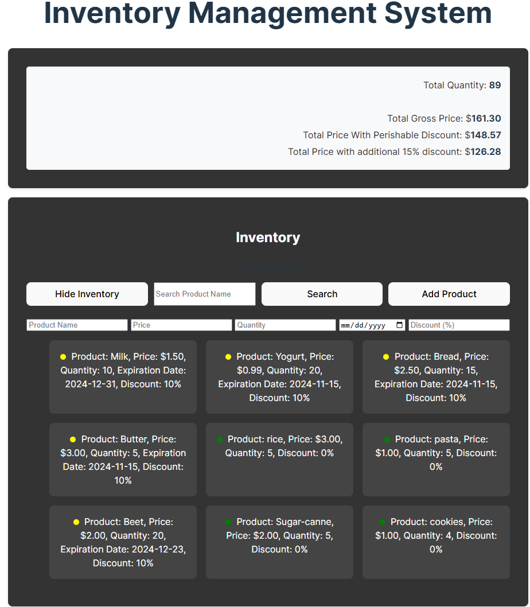

# JavaScript Store Inventory

## Description
A simple inventory management system to manage perishable and non-perishable products.

### Example

To add a product to the inventory, fill out the form with the product name, price, quantity, and expiration date (if applicable), and click "Add Product". The product will be added to the inventory and displayed in the list.

### Screenshots

## Project Structure

<pre>
JavaScriptStoreInventory/
├── index.html
├── inventory-management-system/
│   ├── data/
│   │   └── sampleData.json
│   ├── src/
│   │   ├── classes/
│   │   │   ├── PerishableProduct.js
│   │   │   └── Product.js
│   │   ├── index.js
│   └── styles/
│       └── styles.css
</pre>

#Basic Logic of the Code

1. **Initialization**:
   - On window load, the application checks if the inventory has been initialized in local storage.
   - If not initialized, it fetches sample data from `sampleData.json`, adds it to the store, and saves it to local storage.
   - If initialized, it loads the inventory from local storage.

2. **Adding Products**:
   - Users can add products using a form.
   - The form captures product details and adds the product to the store.
   - The inventory list is updated, and the new product is saved to local storage.

3. **Viewing Inventory**:
   - Users can view the inventory by clicking the "View Inventory" button.
   - A loading indicator is shown while the inventory is being loaded.
   - The inventory list is displayed, and a summary of the inventory is updated.

4. **Searching Products**:
   - Users can search for products by name.
   - The search results are displayed in the inventory list.

5. **Deleting Products**:
   - Each product in the inventory list has a delete button.
   - Clicking the delete button removes the product from the store and updates the inventory list and summary.

styles.css
-The CSS file for styling the application, including layout, colors, and responsive design

index.js
-The main JavaScript file that initializes the application handles form submissions, updates the inventory list, and manages local storage.

PerishableProduct.js
-The PerishableProductProperties class extends the ProductProperties class to include an expiration date for perishable products. It overrides the toString method to include the expiration date in the string representation.

Store.js
-The Store class manages the inventory of products. It provides methods to add, remove, search, and list products, as well as calculate the total value of the inventory.

-index.html: The main HTML file for the application.

-classes: The directory containing the JavaScript classes (Store.js, Product.js, PerishableProduct.js).

Features
-Add perishable and non-perishable products to the inventory.
-View the inventory list.
-Remove products from the inventory.
-Search for products in the inventory.
-inventory grid Display quantity and total cost of items in the inventory.
-Main menu
Total Quantity: 
Total Gross Price: 0
Total Price With Perishable Discount:
Total Price with additional 15% discount:
-Persist inventory data using local storage.

